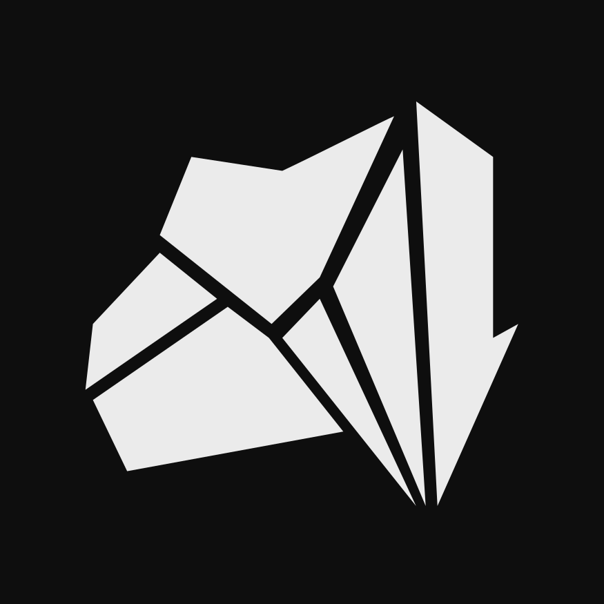

 

  

 

  <b>Coal</b>

  a chat app for people who just want to talk

  <a href="README.pt.md">leia em português</a>

 

  
  
  

 

> The source code is not public yet. Coal is currently in early testing. Once it leaves this phase, the code will be open.

 

Coal is a desktop chat app built for Brazilian communities who want something lightweight, honest, and theirs. No ads. No age verification. No corporate nonsense. Just servers, channels, and people.

It takes inspiration from what Stoat set out to be — open, community-driven, free from the baggage that Discord has been accumulating for years — but built from scratch with a simpler stack and a focus on getting out of your way.

 

## what it is

Servers, channels, real-time messages, file uploads, user profiles, invites — the stuff that matters. A dark interface with customizable colors and fonts, because you spend a lot of time here and it should feel right.

It runs as a desktop app on Linux and Windows via Electron, and uses Supabase under the hood for auth, storage, and real-time communication.

 

## limitations

Coal runs on Supabase's free tier, which means there are real ceilings.

500MB of total database storage. 50,000 monthly active users. No voice or video channels. No mobile app. File uploads go through Catbox, a third-party host, so files can disappear if Catbox removes them. No end-to-end encryption.

These aren't things to hide. If the project grows, the infrastructure will need to grow with it.

 

  made in brazil

